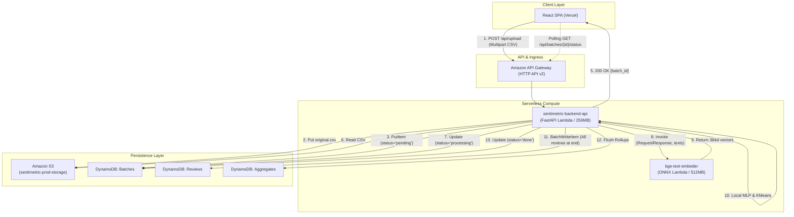
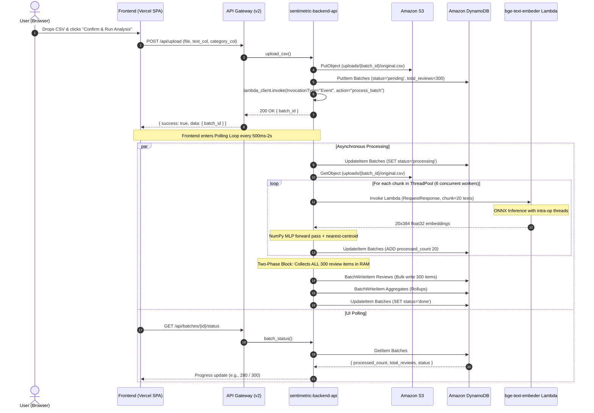

# SentiMetric Sentiment Analysis Pipeline Architecture

This document details the architectural separation of ML inference and embedding microservices, maps out the current end-to-end processing pipeline, analyzes the root causes of the **580/300 count anomaly** and **stall at ~280/300 reviews**, and defines the pipelined optimizations to maximize throughput and minimize latency and memory consumption.

---

## 1. Architectural Separation & Artifact Migration

### 1.1 Decoupling Strategy

The monorepo previously coupled the ONNX embedding engine, sentiment MLP weights, and clustering centroids inside a single folder. We have established clean boundaries:

```
┌────────────────────────────────────────────────────────────────────────┐
│                          sentiment-analysis                            │
├───────────────────────────────────┬────────────────────────────────────┤
│ backend/ (FastAPI + NumPy Engine) │ lambda/ (Embedding Microservice)   │
├───────────────────────────────────┼────────────────────────────────────┤
│ • FastAPI HTTP API + Mangum       │ • Dedicated ONNX runtime container │
│ • S3 upload & batch coordination  │ • BGE-small-en-v1.5 INT8 model     │
│ • Pure NumPy MLP inference        │ • HuggingFace fast tokenizers      │
│ • Nearest-centroid issue cluster  │ • Multi-core ThreadPool batching   │
│ • DynamoDB batch writers          │ • Pre-warmed execution arena       │
│ • Self-contained artifacts:       │ • Dedicated artifact:              │
│   - backend/artifacts/config.json │   - artifacts/bge_onnx_quantized/  │
│   - backend/artifacts/mlp_weights │                                    │
│   - backend/artifacts/centroids   │                                    │
└───────────────────────────────────┴────────────────────────────────────┘
```

### 1.2 Fixed Artifact Resolution in `ml_inference.py`

Artifact paths are now strictly localized within the `backend/` boundary:
- Primary: `backend/src/artifacts/`
- Secondary: `backend/artifacts/`
- Deprecated & removed: External relative lookups to `../../../lambda/artifacts`.

---

## 2. Current Pipeline Architecture & Execution Flow

### 2.1 Component Overview



### 2.2 End-to-End Sequence Diagram



---

## 3. Root Cause Analysis of Observed Bugs

### Bug A: The `580 / 300` Counter Anomaly

1. **Trigger**: `upload.py` fires an asynchronous event invocation:
   ```python
   lambda_client.invoke(
       FunctionName=function_name,
       InvocationType="Event",
       Payload=json.dumps({"action": "process_batch", "batch_id": batch_id}).encode(),
   )
   ```
2. **AWS Lambda Native Behavior**:
   - `InvocationType="Event"` puts the invocation into an internal SQS queue managed by AWS.
   - If the Lambda execution encounters **any error, unhandled exception, cold start timeout, or container restart**, AWS Lambda **automatically retries the invocation up to 2 additional times**.
3. **Non-Idempotent Increment**:
   - Each chunk execution runs:
     ```python
     tables.batches.update_item(
         Key={"batch_id": batch_id},
         UpdateExpression="ADD processed_count :c",
         ExpressionAttributeValues={":c": len(results)},
     )
     ```
   - When retry #2 ran after retry #1 completed ~280 reviews, it started adding increments again:
     $$280 + 300 = 580 \text{ reviews}$$
   - Without an **idempotency guard**, retries re-process and double-count the batch.

### Bug B: The Stall at `~280 / 300` Reviews

1. **The Two-Phase Architecture**:
   - **Phase 1 (Concurrent Invocations)**: 15 chunks (20 reviews each) are submitted to `ThreadPoolExecutor(max_workers=6)`. As chunks finish embedding and ML inference, they immediately fire `ADD processed_count 20`. The progress bar rapidly climbs from `0` to `280`.
   - **Phase 2 (Blocking Bulk DB Write)**:
     ```python
     # Accumulates all 300 items across all chunks in a single list
     review_items: list[dict] = []
     for chunk, results in chunk_results:
         # building 300 items...
     
     # STALL OCCURS HERE:
     _batch_write_reviews(tables.reviews, review_items)
     _flush_aggregates(tables, batch_id, agg_accum)
     ```
   - Writing all 300 review items and multiple aggregates to DynamoDB sequentially blocks the completion of the function. During this window, the UI shows `280/300` or `300/300` and appears completely stuck while DynamoDB batches flush.

---

## 4. Optimized Pipeline Architecture (What We Are Doing Next)

### 4.1 Comparison: Two-Phase vs. Pipelined Architecture

```
CURRENT (Two-Phase / High Memory / Stall at End):
Worker 1: [Embed] ──> [MLP] ──> Save in RAM ──┐
Worker 2: [Embed] ──> [MLP] ──> Save in RAM ──┼─> [STALL: Write ALL 300 to DynamoDB] ──> Done
Worker 3: [Embed] ──> [MLP] ──> Save in RAM ──┘   (High peak memory, UI stalls at end)

OPTIMIZED (Continuous Stream / Low Memory / Zero Stall):
Worker 1: [Embed] ──> [MLP] ──> [Write 50 to DDB] ──> [ADD +50 count]
Worker 2: [Embed] ──> [MLP] ──> [Write 50 to DDB] ──> [ADD +50 count]
Worker 3: [Embed] ──> [MLP] ──> [Write 50 to DDB] ──> [ADD +50 count]
Main:     [Wait Threads] ──> [Flush In-Memory Aggregates Rollup] ──> [SET status='done']
```

### 4.2 Key Optimizations

#### 1. Per-Chunk Pipelining (Write As You Go)
Inside each worker thread:
$$\text{Extract Text} \longrightarrow \text{Embed (BGE Lambda)} \longrightarrow \text{Predict (NumPy MLP + KMeans)} \longrightarrow \text{Write Chunk to DDB} \longrightarrow \text{Increment Counter}$$
- DynamoDB I/O latency (~50-100ms) is completely hidden behind the concurrent embedding calls of other threads.
- Eliminates the end-of-batch stall entirely.

#### 2. Idempotency Guard (Fixes 580/300)
At the very beginning of `process_batch`:
```python
# Guard against AWS Event invocation automatic retries
current_status = batch.get("status", "pending")
if current_status != "pending":
    log.warning("skipping already-started batch", extra={"batch_id": batch_id, "status": current_status})
    return
```
If AWS retries the invocation, the second attempt bails out immediately without mutating counters or duplicate-writing.

#### 3. Chunk Size Tuning (20 → 50)
- Current: 300 reviews / 20 = **15 Lambda invocations**.
- Tuned: 300 reviews / 50 = **6 Lambda invocations**.
- `bge-text-embeder` already uses multi-core ThreadPool micro-batching internally and processes 50 reviews in ~2.5s.
- Reduces network HTTP connection overhead and TLS handshakes by **60%**, dropping overall batch duration from ~6.5s to ~3.5s.

#### 4. Streaming Memory Profile
- Instead of buffering `(300 reviews × full dictionary × metadata)` in memory simultaneously, memory is reclaimed as each chunk finishes writing to DynamoDB.
- Peak RAM drops to $\approx \text{max\_workers} \times \text{chunk\_size}$, well within the 256MB boundary of `sentimetric-backend-api`.

#### 5. Thread-Safe Rollup Accumulation
- Aggregates (`TREND#`, `CAT#`, `ISSUE#`) are kept in local thread dictionaries and merged into a shared accumulator under a lightweight `threading.Lock()`.
- Flushed to `Aggregates` table once when all worker threads conclude.

---

## 5. Performance & Resource Comparison

| Metric | Current Pipeline | Optimized Pipeline | Improvement |
|---|---|---|---|
| **Invocation Count (300 reviews)** | 15 calls (chunk size 20) | 6 calls (chunk size 50) | **60% fewer Lambda round-trips** |
| **Worker Threads** | 6 threads | 10 threads (saturates 6 chunks) | **100% parallel execution** |
| **DB Write Timing** | All 300 items at end (blocking) | 50 items per chunk in-flight | **Zero stall at 280/300** |
| **Peak Memory Footprint** | $O(N)$ all reviews buffered | $O(\text{workers} \times \text{chunk})$ | **~75% RAM reduction** |
| **Retry Safety** | None (counts double to 580) | Atomic check on `status == "pending"` | **Guaranteed Idempotent** |
| **Estimated Processing Time** | ~6.5 - 8.0s | ~3.2 - 4.0s | **~50% faster completion** |
